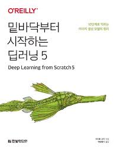

  

# 📖 밑바닥부터 시작하는 딥러닝 5
본 레포지토리는 『밑바닥부터 시작하는 딥러닝 5』를 공부하기 위해 제작되었다. 『밑바닥부터 시작하는 딥러닝 5』는 생성 모델을 다루는 책으로, 확률과 분포의 기초부터 확산 모델까지 폭넓은 내용을 담고 있다. 본 레포지토리는 도서에서 제공하는 예제 코드를 정리해 두었으며, 각 내용을 함축적으로 정리한 개인 학습 메모도 함께 포함되어 있다.

# 📁 Folder Structure
| Folder Name | Chapter Title | Description |
|---------|----------|----------------------|
| [CH01](CH01/) | 정규분포 | Chapter 1에서 사용한 코드 및 자료 |
| [CH02](CH02/) | 최대 가능도 추정 | Chapter 2에서 사용한 코드 및 자료 |
| [CH01](CH01/) | 다변량 정규 분포 | Chapter 3에서 사용한 코드 및 자료 |
| [CH01](CH01/) | 가우스 혼합 모델 | Chapter 4에서 사용한 코드 및 자료 |
| [CH01](CH01/) | EM 알고리즘 | Chapter 5에서 사용한 코드 및 자료 |
| [CH01](CH01/) | 신경망 | Chapter 6에서 사용한 코드 및 자료 |
| [CH01](CH01/) | 변이형 오토인코더 | Chapter 7에서 사용한 코드 및 자료 |
| [CH01](CH01/) | 확산 모델 이론 | Chapter 8에서 사용한 코드 및 자료 |
| [CH01](CH01/) | 확산 모델 구현 | Chapter 9에서 사용한 코드 및 자료 |
| [CH01](CH01/) | 확산 모델 응용 | Chapter 10에서 사용한 코드 및 자료 |

# ⚙️ Requirements
- Python
- Numpy
- PyTorch
- torchvision
- tqdm

# 📜 License
본 레포지토리는 MIT License에서 작성되었습니다.